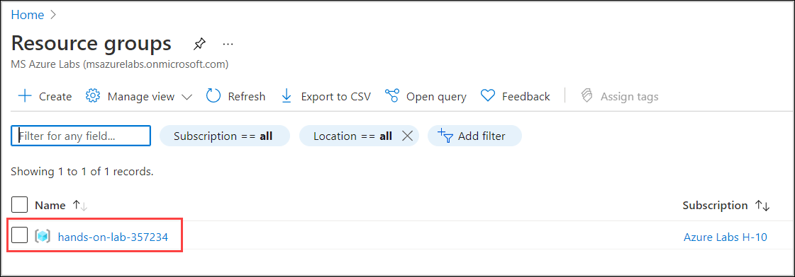
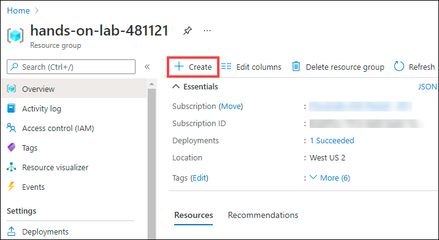
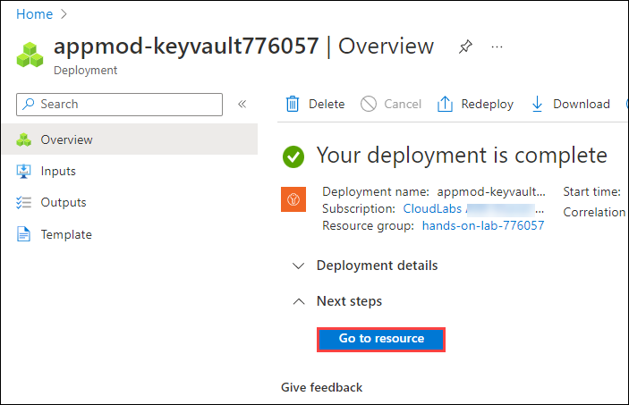
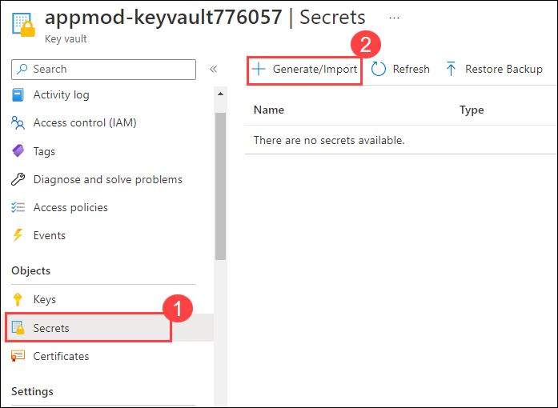
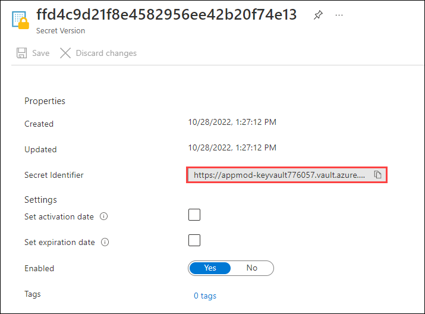

# Exercise 9: Securing web app secrets with Azure Key Vault and Managed Identity

## Task 1: Setting up Azure Key vault

1. Select your **resource group**. 

   

1. Select **Create** inside the resource group to add a new resource.

    
    
1. Type **Key Vault(1)** into the search box and select **Key Vault(2)** from the dropdown.

    

1. Select **Create** to continue.

    
    
1. On the **Basics** tab of key vault. Provide key Vault name as **appmod-keyvault**, leave all other options as default and click on **Review + create**.

    
    
1. On the **Review + create** page, review all the options and click on **Create**.

    
    
1. After creating the Key Vault successfully, click on **Go to resource**.

    

1. Switch to the **Secrets (1)** blade, and select **+Generate/Import (2)**.

   
   
1. On Create secret panel, enter the following details and click on **Create**.
   
   - **upload options**: `Manual`
   - **Name(1)**: Enter `DB-secret`
   - **Value**: Enter SQL Connection String you copied in Exercise 3, Task 6, Step 3.

   
   
1. Once the secret is successfully created, click on the secret to copy the secret identifier.

   

1. On the Secret Version panel, copy the **Secret Identifier** value and paste it in the notepad for future use.

   
   
# Task 2:

   
   
