# Exercise 9: Securing web app secrets with Azure Key Vault and Managed Identity

## Task 1: Setting up Azure Key vault

1. Select your **resource group**. 

   

1. Select **Create** inside the resource group to add a new resource.

    
    
1. Type **Key Vault(1)** into the search box and select **Key Vault(2)** from the dropdown.

    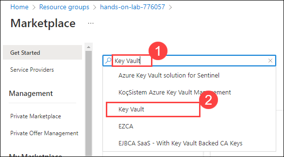

1. Select **Create** to continue.

    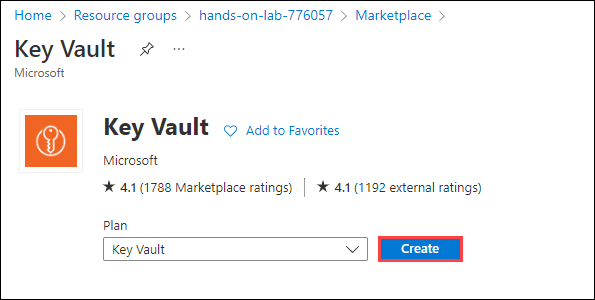
    
1. On the **Basics** tab of key vault. Provide key Vault name as **appmod-keyvault**, leave all other options as default and click on **Review + create**.

    
    
1. On the **Review + create** page, review all the options and click on **Create**.

    
    
1. After creating the Key Vault successfully, click on **Go to resource**.

    

1. Switch to the **Secrets (1)** blade, and select **+Generate/Import (2)**.

   
   
1. On Create secret panel, enter the following details and click on **Create**.
   
   - **upload options**: `Manual`
   - **Name(1)**: Enter `DB-secret`
   - **Value**: Enter SQL Connection String you copied in Exercise 3, Task 6, Step 3.

   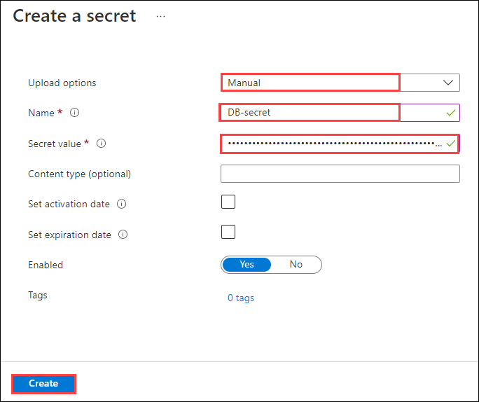
   
1. Once the secret is successfully created, click on the secret to copy the secret identifier.

   

1. On the Secret Version panel, copy the **Secret Identifier** value and paste it in the notepad for future use.

   
   
## Task 2: Create and assign system assigned managed identity

1. Go back to the resource list and navigate to your **(2) partsunlimited-web-<inject key="DeploymentID" enableCopy="false"/>**
App Service resource. You can search for **(1)** `partsunlimited-web` to find your Web App and App Service Plan.

   
   
1. Switch to the **Identity** blade under settings.
   
   
   
1. On **System assigned (1)** managed identity, select **On (2)** and click on **Save (3)**. click on **Yes** for the **Enable system assigned managed identity** pop up.

   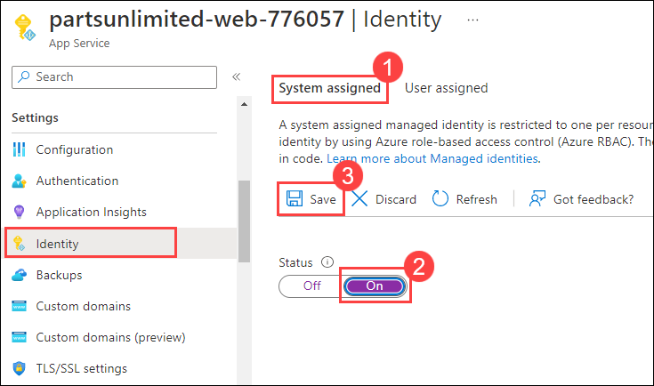
   
1. Once the managed identity the assigned, copy the **ObjectID** and paste it in the notepad.

   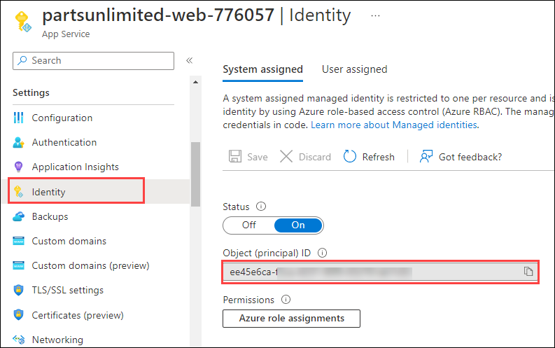
   
1. Go back to the Resource group and You search for **(1)** `appmod-keyvault` to find your Key Vault and click on it **(2)**.

   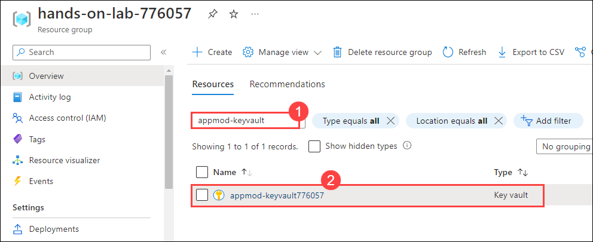
   
1. From left navigation pane, select **Access policies** and click on **Create** to create the access policy for keyvault.

   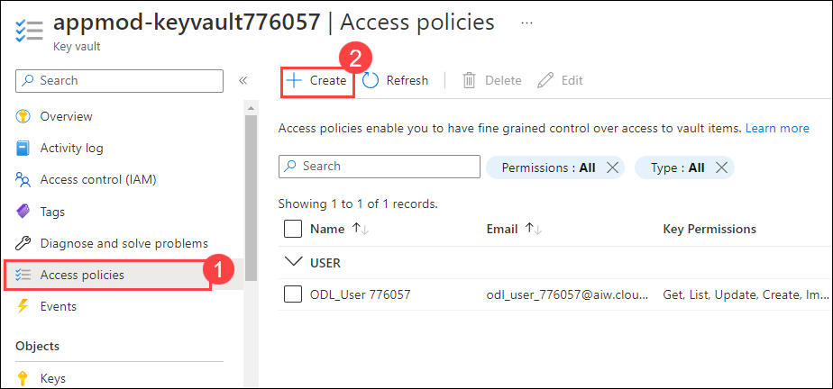
 
1. Under Permissions tab of **Create an access policy** panel, select the following:

   - **Configure from template**: Select `Secret Management` **(1)**
   - **Secret permissions**: select `Get` **(2)**
   - Click on **Next (3)**

   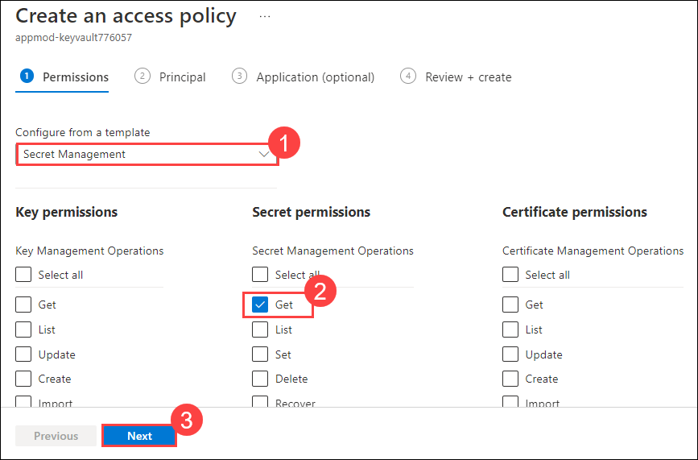
   
1. Under **Principles** tab, enter the **system assigned managed identity (1)** you copied previously on step 4 and select it **(2)**. Click on **Next (3)**.

   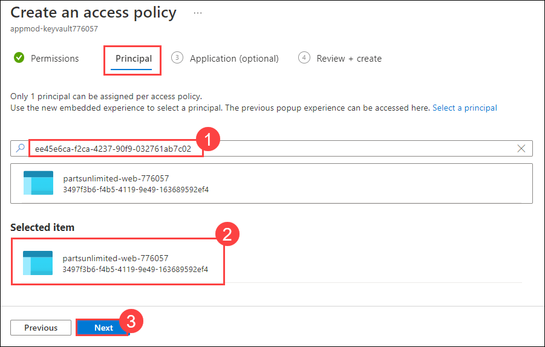
   
1. On the **Application(Optional)** tab, leave all the values to default and click on **Next**.

1. Click on **Create** under the **Review + create** tab.

    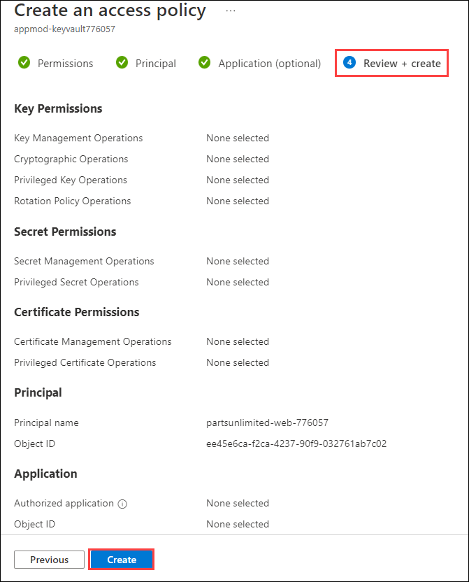
    
1. Once the access policy creation is completed, make sure that the application access policy is listed as shown below.

   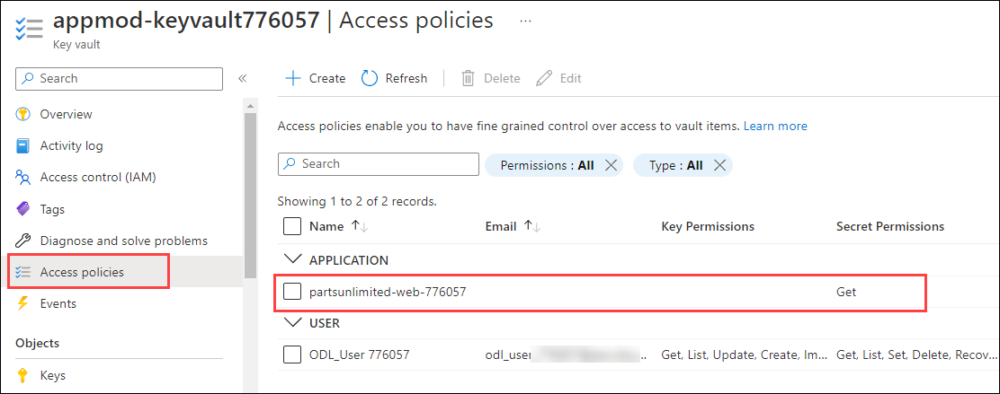
    
    
## Task 3: 

1. Go back to the resource list and navigate to your **(2) partsunlimited-web-<inject key="DeploymentID" enableCopy="false"/>**
App Service resource. You can search for **(1)** `partsunlimited-web` to find your Web App.

   

1. Switch to the **Configuration (1)** blade, and select the connection string with the name **DefaultConnectionString (2)**.

   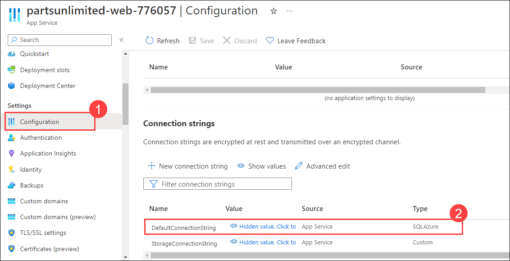
   
1. Edit the keyvault secret in the **@Microsoft.KeyVault(SecretUri=Secret_identifier)** format. Replace the **Secret_identifier** with the value you have copied in task 1, step 11. Copy the edited secret value that looks like below:

    `@Microsoft.KeyVault(SecretUri=https://appmod-keyvault776057.vault.azure.net/secrets/DB-secret/ffd4c9d21f8e4582956ee42b20f74e13)`
 
1. On the **Add/Edit connection string** panel, enter the copied secret key value from previous step in the value field and click on **OK**.

   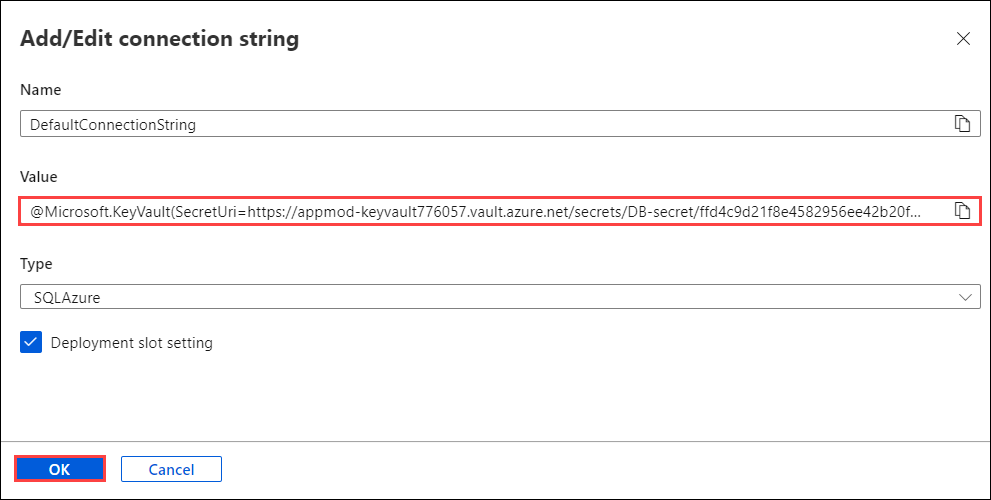
   
1. Click on **Save** to save the connection string changes.

    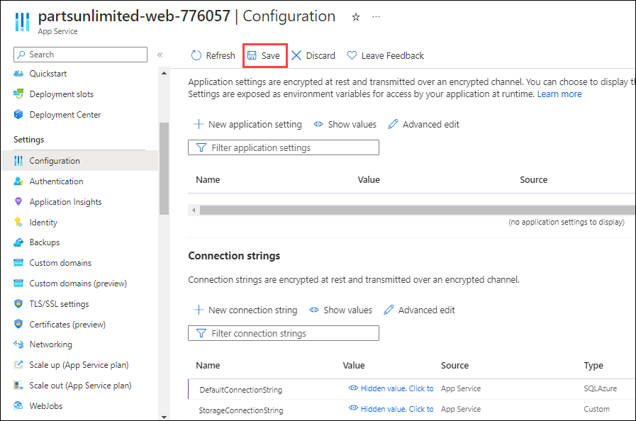
    
1. Scroll down to the connection string details and observe that the **DefaultConnectionString** is showing **Key Vault** as the Source.
   
   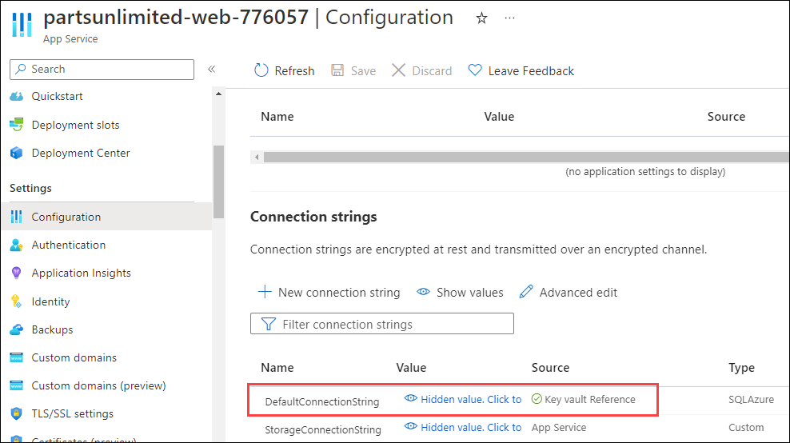
   
1. Switch to the **Overview (1)** blade, and select **URL (2)** to navigate to the Parts Unlimited web site hosted in our Azure App Service using Azure SQL Database.

    
   
   
