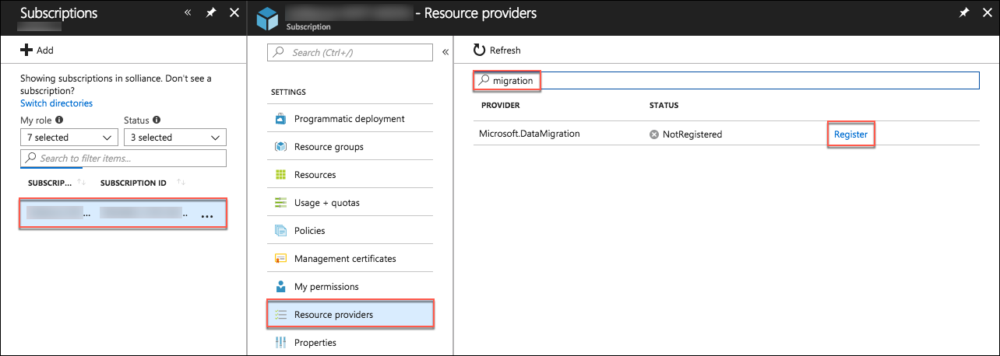
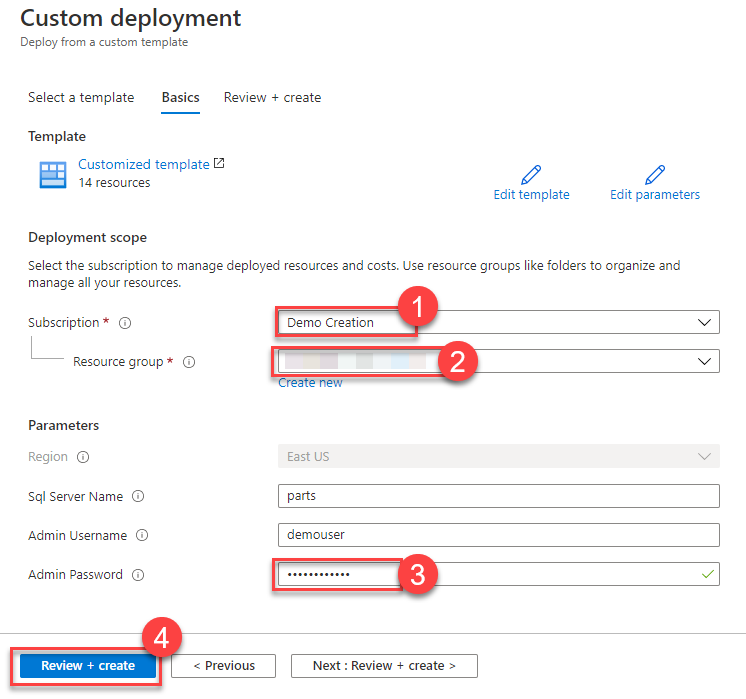

App modernization

Before the hands-on lab setup guide

June 2019

Information in this document, including URL and other Internet Web site references, is subject to change without notice. Unless otherwise noted, the example companies, organizations, products, domain names, e-mail addresses, logos, people, places, and events depicted herein are fictitious, and no association with any real company, organization, product, domain name, e-mail address, logo, person, place or event is intended or should be inferred. Complying with all applicable copyright laws is the responsibility of the user. Without limiting the rights under copyright, no part of this document may be reproduced, stored in or introduced into a retrieval system, or transmitted in any form or by any means (electronic, mechanical, photocopying, recording, or otherwise), or for any purpose, without the express written permission of Microsoft Corporation.

Microsoft may have patents, patent applications, trademarks, copyrights, or other intellectual property rights covering subject matter in this document. Except as expressly provided in any written license agreement from Microsoft, the furnishing of this document does not give you any license to these patents, trademarks, copyrights, or other intellectual property.

The names of manufacturers, products, or URLs are provided for informational purposes only and Microsoft makes no representations and warranties, either expressed, implied, or statutory, regarding these manufacturers or the use of the products with any Microsoft technologies. The inclusion of a manufacturer or product does not imply endorsement of Microsoft of the manufacturer or product. Links may be provided to third party sites. Such sites are not under the control of Microsoft and Microsoft is not responsible for the contents of any linked site or any link contained in a linked site, or any changes or updates to such sites. Microsoft is not responsible for webcasting or any other form of transmission received from any linked site. Microsoft is providing these links to you only as a convenience, and the inclusion of any link does not imply endorsement of Microsoft of the site or the products contained therein.

© 2019 Microsoft Corporation. All rights reserved.

Microsoft and the trademarks listed at <https://www.microsoft.com/en-us/legal/intellectualproperty/Trademarks/Usage/General.aspx> are trademarks of the Microsoft group of companies. All other trademarks are property of their respective owners.

**Contents**

<!-- TOC -->

- [App modernization before the hands-on lab setup guide](#App-modernization-before-the-hands-on-lab-setup-guide)
  - [Requirements](#Requirements)
  - [Before the hands-on lab](#Before-the-hands-on-lab)
    - [Task 1: Provision a resource group](#Task-1-Provision-a-resource-group)
    - [Task 2: Register required resource providers](#Task-2-Register-required-resource-providers)
    - [Task 3: Run ARM template to provision lab resources](#Task-3-Run-ARM-template-to-provision-lab-resources)

<!-- /TOC -->

# App modernization before the hands-on lab setup guide

## Requirements

1. Microsoft Azure subscription must be pay-as-you-go or MSDN.
   - Trial subscriptions will *not* work.
   - You must have permissions to register resource providers within your Azure subscription to complete the steps below.

## Before the hands-on lab

Duration: 45 minutes

In this exercise, you will set up your environment for use in the rest of the hands-on lab. You should follow all steps provided *before* attending the Hands-on lab.

> **IMPORTANT**: Many Azure resources require globally unique names. Throughout these steps you will see the word "SUFFIX" as part of resource names. You should replace this with your Microsoft alias, initials, or another value to ensure resources are uniquely named.

### Task 1: Provision a resource group

In this task, you will create an Azure resource group which will serve as a container for the resources used throughout this lab.

1. In the [Azure portal](https://portal.azure.com), select **Resource groups**, select **+Add**, then enter the following in the Create an empty resource group blade:

    - **Subscription**: Select the subscription you are using for this hands-on lab.
    - **Resource group**: Enter hands-on-lab-SUFFIX.
    - **Region**: Select the region you would like to use for resources in this hands-on lab. Remember this location so you can use it for the other resources you'll provision throughout this lab.

    

2. Select **Review + Create**.

3. On the Review + Create tab, select **Create** to provision the resource group.

### Task 2: Register required resource providers

In this task, you will register the `Microsoft.DataMigration` and `Microsoft.Search` resource providers with your subscription in Azure. These resource provider allow Azure Search and the Azure Database Migration Service to be provisioned within your Azure subscription.

1. In the [Azure portal](https://portal.azure.com), select **All services** from the Azure navigation pane, and then select **Subscriptions**.

    

2. Select the subscription you are using for this hands-on lab from the list, select **Resource providers**, enter "migration" into the filter box, select **Microsoft.DataMigration** and then select **Register**.

    

3. It can take a couple of minutes for the registration to complete. Make sure you see a status of **Registered** before moving on.

    

4. Next, enter "search" into the filter box to locate the `Microsoft.Search` resource provider. If the status is not **Registered**, select **Register**, and wait for the resource status to be registered. 

>**Note**: You may need to select Refresh to see the updated status.

    

### Task 3: Run ARM template to provision lab resources

In this task, you will run an Azure Resource Manager (ARM) template to deploy the resources required for this hands-on lab. The resources created by the ARM template include:

- Azure Blob Storage account
- A lab virtual machine (VM) with Visual Studio 2019 Community edition and SQL Server Management Studio (SSMS) installed
- A SQL Server 2008 R2 VM with the Microsoft Data Migration Assistant (DMA) installed
- Azure SQL Database
- Azure Database Migration Service (DMS)
- Azure App Service Plan
- App Service (Web App)
- App Service (API App)
- Function App
- API Management
- SignalR service
- Key Vault
- Azure Search
- Virtual Network

> You can review the steps to manually provision the lab resources in [Appendix A](./Appendix-A.md).

1. To run the ARM template deployment, select the **Deploy to Azure** button below, which will open a custom deployment screen in the Azure portal.

    

2. On the custom deployment screen in the Azure portal, enter the following:

    - **Subscription**: Select the subscription you are using for this hands-on lab.
    - **Resource group**: Select the hands-on-lab-SUFFIX resource group from the dropdown list.
    - **Location**: Select the location you used for the hands-on-lab-SUFFIX resource group.
    - **SQL Server Name**: Accept the default value, **contosoinsurance**. 
    >**Note**: The actual name must be globally unique, so a unique string will be generated from your Resource Group and appended to the name during provisioning.
    - **Admin Username**: Accept the default value, **demouser**.
    - **Admin Password**: Accept the default value, **Password.1!!**.
    - **API Management Email**: Enter an email to use for admin notifications from API Management.
    - Check the box to agree to the Azure Marketplace terms and conditions.

    

3. Select **Purchase** to start provisioning the lab resources.

    > **Note**: The deployment of the custom ARM template takes about 30 minutes to complete.

4. You can monitor the progress of the deployment by navigating to the hands-on-lab-SUFFIX resource group in the Azure portal, and then selecting **Deployments** from the left-hand menu. The deployment will be named **Microsoft.Template**. Select that to view the progress of each item in the template.

    

You should follow all steps provided *before* attending the Hands-on lab.
